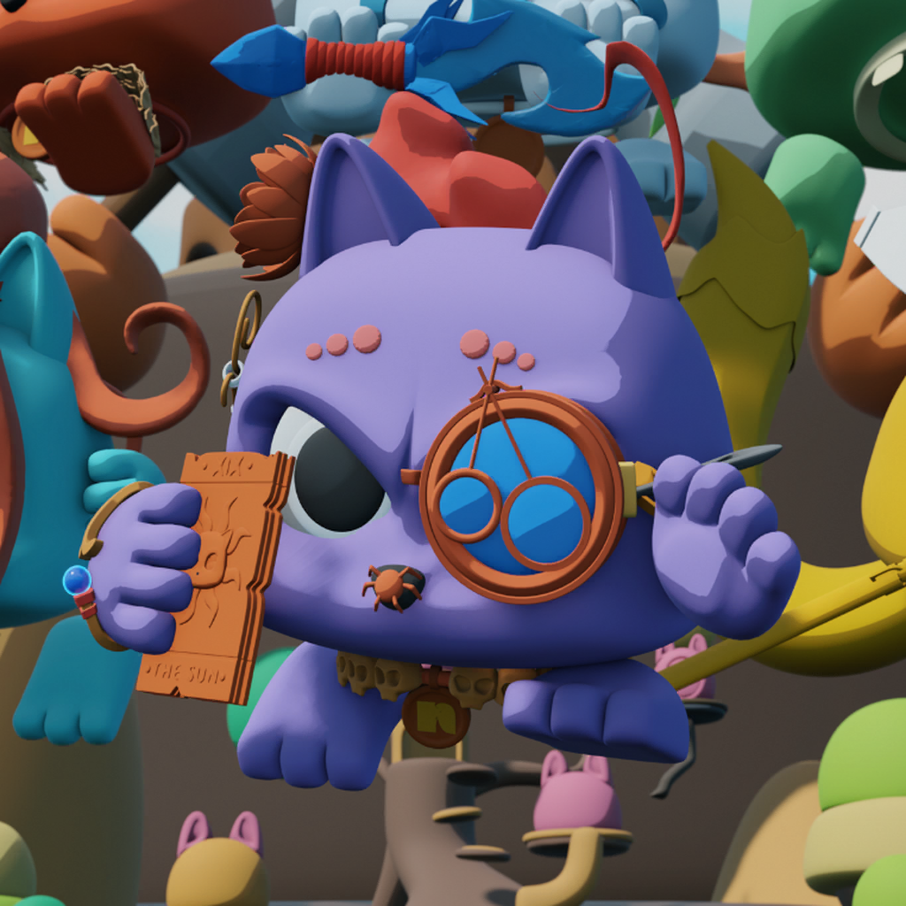

          <animated-image data-catalyst="" style="width: 300px;">
      
        <a data-target="animated-image.replacedLink" class="AnimatedImagePlayer-images" href="1920x1080bb-80.png" target="_blank">
          
        
            
          <canvas class="AnimatedImagePlayer-stillImage" aria-hidden="true" width="300" height="300"></canvas></a>
        <button data-target="animated-image.imageButton" class="AnimatedImagePlayer-images" tabindex="-1" aria-label="Play gif" hidden=""></button>
        
          <button data-target="animated-image.playButton" class="AnimatedImagePlayer-button" aria-label="Play gif">
            <svg aria-hidden="true" focusable="false" class="octicon icon-play" width="16" height="16" viewBox="0 0 16 16" fill="none" xmlns="http://www.w3.org/2000/svg">
              <path d="M4 13.5427V2.45734C4 1.82607 4.69692 1.4435 5.2295 1.78241L13.9394 7.32507C14.4334 7.63943 14.4334 8.36057 13.9394 8.67493L5.2295 14.2176C4.69692 14.5565 4 14.1739 4 13.5427Z">
            </path></svg>
            <svg aria-hidden="true" focusable="false" class="octicon icon-pause" width="16" height="16" viewBox="0 0 16 16" xmlns="http://www.w3.org/2000/svg">
              <rect x="4" y="2" width="3" height="12" rx="1"></rect>
              <rect x="9" y="2" width="3" height="12" rx="1"></rect>
            </svg>
          </button>
          <a data-target="animated-image.openButton" aria-label="Open gif in new window" class="AnimatedImagePlayer-button" href="https://github.com/Moataz-Elmesmary/Moataz-Elmesmary/blob/main/git.gif" target="_blank">
            <svg aria-hidden="true" class="octicon" xmlns="http://www.w3.org/2000/svg" viewBox="0 0 16 16" width="16" height="16">
              <path fill-rule="evenodd" d="M10.604 1h4.146a.25.25 0 01.25.25v4.146a.25.25 0 01-.427.177L13.03 4.03 9.28 7.78a.75.75 0 01-1.06-1.06l3.75-3.75-1.543-1.543A.25.25 0 0110.604 1zM3.75 2A1.75 1.75 0 002 3.75v8.5c0 .966.784 1.75 1.75 1.75h8.5A1.75 1.75 0 0014 12.25v-3.5a.75.75 0 00-1.5 0v3.5a.25.25 0 01-.25.25h-8.5a.25.25 0 01-.25-.25v-8.5a.25.25 0 01.25-.25h3.5a.75.75 0 000-1.5h-3.5z"></path>
            </svg>
          </a>
        
      </animated-image>
    

<h1 align="center">Hi, I'm Mohamed Mousa 👋</h1>
<h3 align="center">Junior in Data science.</h3>

  

  

<h3 align="left">Connect with me:</h3>

<h3 align="left">Languages and Tools:</h3>

    

&nbsp;

  

        

